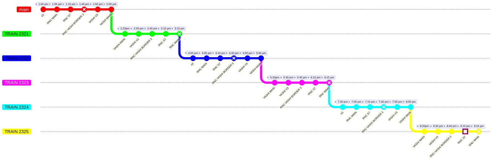

# train_map_test

```mermaid

%%{init: { 'logLevel': 'debug', 'theme': 'default' , 'themeVariables': {
              'git0': '#ff0000',
              'git1': '#00ff00',
              'git2': '#0000ff',
              'git3': '#ff00ff',
              'git4': '#00ffff',
              'git5': '#ffff00',
              'git6': '#ff00ff',
              'git7': '#00ffff'
       } } }%%
gitGraph
commit id:"s3"  tag:"1:00 pm"
commit id:"RNC MAIN" tag:"1:05 pm"
commit id:"RNC S7" tag:"1:10 pm"
commit id: "RNC-VASHI BORDER 3" type: REVERSE tag: "1:40 pm"
commit id:"VASHI V3" tag:"1:50 pm"
commit id:"VASHI MAIN" tag:"2:00 pm"
branch "TRAIN 2321"
%% 
commit id:"VASHI MAIN " tag:"2:20pm"
commit id:"VASHI V3 " tag:"2:30 pm"
commit id:"RNC-VASHI BORDER 3 " tag:"2:40 pm"
commit id: "RNC S7 " tag:"3:10 pm"
commit id:"RNC MAIN "type:REVERSE tag:"3:15 pm"
branch "TRAIN 2322"
commit id:" s3"   tag:"4:00 pm"
commit id:" RNC MAIN" tag:"4:05 pm"
commit id:" RNC S7" tag:"4:10 pm"
commit id: " RNC-VASHI BORDER 3" type: REVERSE tag: "4:40 pm"
commit id:" VASHI V3" tag:"4:50 pm"
commit id:" VASHI MAIN" tag:"5:00 pm"
branch "TRAIN 2323"
commit id:"VASHI MAIN    " tag:"5:20pm"
commit id:"VASHI V3     " tag:"5:30 pm"
commit id:"RNC-VASHI BORDER 3   " tag:"5:40 pm"
commit id: "RNC S7   " tag:"6:10 pm"
commit id:"RNC MAIN   "type:REVERSE tag:"6:15 pm"
branch "TRAIN 2324"
commit id:"  s3"   tag:"7:00 pm"
commit id:"  RNC MAIN" tag:"7:05 pm"
commit id:"  RNC S7" tag:"7:10 pm"
commit id:"  RNC-VASHI BORDER 3" type: REVERSE tag: "7:40 pm"
commit id:"  VASHI V3" tag:"7:50 pm"
commit id:"  VASHI MAIN" tag:"8:00 pm"
branch "TRAIN 2325"
%% 
commit id:"  VASHI MAIN " tag:"8:20pm"
commit id:"  VASHI V3 " tag:"8:30 pm"
commit id:"  RNC-VASHI BORDER 3 " tag:"8:40 pm"
commit id: "  RNC S7 " type:HIGHLIGHT tag:"9:10 pm"
commit id:"  RNC MAIN "type:REVERSE tag:"9:15 pm"

```
